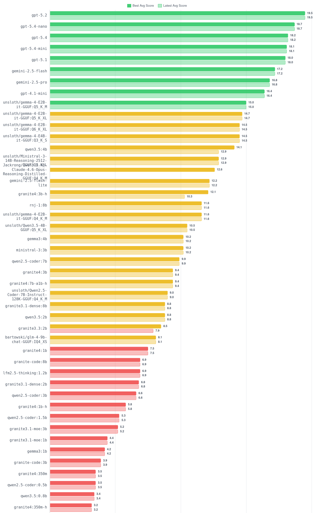

# llm-bug-bench

A web-based benchmark suite that evaluates LLMs' ability to detect bugs in code. Focused on concurrency issues, error handling, and distributed systems patterns in Go and Python, plus theoretical questions (CAP theorem, Byzantine faults).

Supports **Ollama**, **llama.cpp** (local models), **OpenAI**, and **Google Gemini** as providers. Includes an LLM judge that automatically scores responses on a 1–20 rubric, a sortable leaderboard, and full test case management — all through a web UI.

## Table of Contents

- [Features](#features)
- [Leaderboard](#leaderboard)
- [Quick Start](#quick-start)
- [Configuration](#configuration)
- [Providers](#providers)
- [LLM Judge](#llm-judge)
- [Test Suite](#test-suite)
- [Results Format](#results-format)
- [Architecture](#architecture)

## Features

- **Multi-provider support** — run benchmarks against Ollama, OpenAI, Gemini, or llama.cpp from a single interface
- **Batch running** — queue multiple models for sequential benchmark runs (Ollama and llama.cpp)
- **Ollama model management** — pull, list, and delete models directly from the UI
- **Model eviction** — automatically unload models from memory after a test suite run
- **LLM judge scoring** — automated evaluation with a 1–20 rubric using an OpenAI judge model
- **Token cost estimation** — estimate API costs per run
- **Sortable leaderboard** — compare models by score, speed (tok/s), and number of runs
- **Test case CRUD** — create, edit, and delete YAML test cases from the browser
- **Run comparison** — side-by-side per-test scoring between any two runs
- **Export** — download results as CSV, Markdown, or leaderboard chart as PNG
- **Dark mode** — toggle with system preference detection
- **Real-time progress** — SSE streaming for run execution and judge scoring

## Leaderboard

Horizontal bar chart comparing each model's bug-detection accuracy on a 1–20 rubric scale. Each model shows its **best** (highest across all runs) and **latest** (most recent run) average scores, color-coded by performance tier: green (≥15), yellow (≥8), and red (<8).

<p align="center">
    
</p>

### Models tested

| Cloud                 | Local (ollama and llama.cpp)                                        |
| --------------------- | ------------------------------------------------------------------- |
| gpt-5.4               | qwen3.5:4b                                                          |
| gpt-5.4-mini          | qwen3.5:2b                                                          |
| gpt-5.4-nano          | qwen3.5:0.8b                                                        |
| gpt-5.2               | gemma3:4b                                                           |
| gpt-5.1               | gemma3:1b                                                           |
| gpt-4.1-mini          | granite4:7b-a1b-h                                                   |
| gemini-2.5-pro        | granite4:3b-h                                                       |
| gemini-2.5-flash      | granite4:3b                                                         |
| gemini-2.5-flash-lite | granite4:1b-h                                                       |
|                       | granite4:1b                                                         |
|                       | granite4:350m-h                                                     |
|                       | granite4:350m                                                       |
|                       | granite3.1-dense:8b                                                 |
|                       | granite3.1-dense:2b                                                 |
|                       | granite3.1-moe:3b                                                   |
|                       | granite3.1-moe:1b                                                   |
|                       | granite3.3:2b                                                       |
|                       | granite-code:8b                                                     |
|                       | granite-code:3b                                                     |
|                       | rnj-1:8b                                                            |
|                       | ministral-3:3b                                                      |
|                       | lfm2.5-thinking:1.2b                                                |
|                       | functiongemma:270m                                                  |
|                       | unsloth/Ministral-3-14B-Reasoning-2512-GGUF:Q2_K_L                  |
|                       | unsloth/Qwen3.5-4B-GGUF:Q5_K_XL                                     |
|                       | unsloth/Qwen2.5-Coder-7B-Instruct-128K-GGUF:Q4_K_M                  |
|                       | Jackrong/Qwen3.5-4B-Claude-4.6-Opus-Reasoning-Distilled-GGUF:Q4_K_M |
|                       | bartowski/glm-4-9b-chat-GGUF:IQ4_XS                                 |
|                       | unsloth/gemma-4-E2B-it-GGUF:Q5_K_M                                  |
|                       | unsloth/gemma-4-E2B-it-GGUF:Q5_K_XL                                 |
|                       | unsloth/gemma-4-E2B-it-GGUF:Q6_K_XL                                 |
|                       | unsloth/gemma-4-E4B-it-GGUF:Q3_K_S                                  |
|                       | unsloth/gemma-4-E2B-it-GGUF:Q4_K_M                                  |
|                       | qwen2.5-coder:7b                                                    |
|                       | qwen2.5-coder:3b                                                    |
|                       | qwen2.5-coder:1.5b                                                  |
|                       | qwen2.5-coder:0.5b                                                  |

## Quick Start

**Prerequisites:** Python 3.13+, [Poetry](https://python-poetry.org/), [Ollama](https://ollama.com) (for local models)

```bash
git clone <repo-url> && cd llm-bug-bench
poetry install
make up            # dev with hot-reload
```

Open [http://localhost:8080](http://localhost:8080).

## Configuration

### Make targets

Everything runs through `make`. Run `make help` to see all targets.

| Target           | Description                                        |
| ---------------- | -------------------------------------------------- |
| `make up`        | Start dev environment (hot-reload, source mounted) |
| `make prod`      | Start production environment                       |
| `make down`      | Stop all containers                                |
| `make build`     | Build production Docker image                      |
| `make test`      | Run tests with coverage via Docker                 |
| `make clean`     | Stop containers and delete results                 |
| `make results`   | Print a summary of all saved runs                  |
| `make precommit` | Run formatters and linters                         |

Override variables on the command line: `make up PORT=3000 RESULTS_DIR=./my-results`

### Environment variables

| Variable         | Default                  | Description                                       |
| ---------------- | ------------------------ | ------------------------------------------------- |
| `PORT`           | `8080`                   | Web server port                                   |
| `RESULTS_DIR`    | `./results`              | Results output directory                          |
| `BENCHMARKS_DIR` | `./benchmarks`           | YAML benchmark cases directory                    |
| `OLLAMA_URL`     | `http://localhost:11434` | Ollama API base URL (overridable in the UI)       |
| `LLAMACPP_URL`   | `http://localhost:8095`  | llama.cpp server base URL (overridable in the UI) |
| `OPENAI_API_KEY` | —                        | Required for LLM judge scoring                    |

## Providers

All provider configuration is done through the **New Run** page (`/runs/new`).

- **Ollama** — select provider, enter model name (e.g., `llama3:8b`), optionally change Ollama URL
- **llama.cpp** — point to a running llama.cpp server, supports batch running and auto-eviction
- **OpenAI** — enter model name (e.g., `gpt-4o`) and API key (used only for the run, never stored)
- **Gemini** — enter model name (e.g., `gemini-2.5-flash`) and API key (uses OpenAI-compatible endpoint)

## LLM Judge

Uses an OpenAI model (default: `gpt-5.2-chat-latest`) to score responses against expected issues on a 1–20 rubric. Requires `OPENAI_API_KEY` env var or per-request key via the judge modal. Trigger from any run detail page with **Judge All**.

| Score | Meaning                                                  |
| ----- | -------------------------------------------------------- |
| 17–20 | All issues found with precise root cause and consequence |
| 13–16 | Most issues found, minor gaps                            |
| 9–12  | Some issues found, significant gaps                      |
| 5–8   | Few issues found, or vague explanations                  |
| 1–4   | Issues missed, wrong analysis, or hallucinated bugs      |

## Test Suite

Ships with 12 test cases across three categories. Create, edit, and delete tests from the web UI at `/tests`, or add a `.yaml` file anywhere under `benchmarks/` (auto-discovered).

| ID                | Language | Title                                     | Difficulty |
| ----------------- | -------- | ----------------------------------------- | ---------- |
| `go_race_001`     | Go       | Race condition in concurrent counter      | easy       |
| `go_deadlock_002` | Go       | Deadlock from inconsistent mutex ordering | medium     |
| `go_chan_003`     | Go       | Unbuffered channel blocks forever         | easy       |
| `go_retry_004`    | Go       | Retry loop off-by-one error               | medium     |
| `go_grpc_005`     | Go       | Missing error handling in gRPC call       | easy       |
| `py_race_001`     | Python   | Race condition on shared list             | easy       |
| `py_deadlock_002` | Python   | Deadlock with non-reentrant lock          | medium     |
| `py_retry_003`    | Python   | Broken exponential backoff                | medium     |
| `py_socket_004`   | Python   | Missing error handling in socket code     | easy       |
| `py_async_005`    | Python   | Asyncio task swallows cancellation        | hard       |
| `theory_cap_001`  | Theory   | CAP Theorem trade-offs                    | medium     |
| `theory_bft_002`  | Theory   | Byzantine Fault Tolerance                 | hard       |

<details>
<summary>YAML format for new tests</summary>

```yaml
id: unique_test_id
title: "Short description"
language: go # go | python | theory (or any string)
difficulty: easy # easy | medium | hard
prompt: |
  The prompt sent to the LLM.
code: | # optional — omit for theory questions
  func main() { /* buggy code */ }
expected_issues:
  - "Description of bug 1"
  - "Description of bug 2"
notes: | # optional, not sent to the LLM
  Reviewer notes.
```

</details>

## Results Format

Results are stored as JSON in `results/<model_name>/run_NNN/`:

- **`<test_id>.json`** — prompt sent, raw response, token counts, elapsed time, tok/s
- **`<test_id>.judge.json`** — score, explanation, issues found/expected/matched/missed
- **`metadata.json`** — run config (model, provider, temperature, system prompt, timestamps)

<details>
<summary>Example JSON structures</summary>

**Per-test result** (`<test_id>.json`):

```json
{
  "test_id": "go_race_001",
  "model": "llama3:8b",
  "prompt_sent": "[SYSTEM] ... [USER] ...",
  "response": "The raw LLM output...",
  "prompt_tokens": 150,
  "completion_tokens": 320,
  "total_tokens": 470,
  "elapsed_seconds": 4.23,
  "tokens_per_second": 75.7,
  "timestamp": "2025-03-26T10:30:00+00:00",
  "error": null
}
```

**Judge result** (`<test_id>.judge.json`):

```json
{
  "test_id": "go_race_001",
  "judge_model": "gpt-5.2-chat-latest",
  "score": 15,
  "explanation": "The LLM correctly identified...",
  "issues_found": ["Race condition on counter"],
  "issues_expected": ["Unsynchronized access to shared counter"],
  "issues_matched": ["Unsynchronized access to shared counter"],
  "issues_missed": [],
  "timestamp": "2025-03-26T10:35:00+00:00"
}
```

**Run metadata** (`metadata.json`):

```json
{
  "run_id": "run_001",
  "model": "llama3:8b",
  "provider": "ollama",
  "api_url": "http://localhost:11434/v1",
  "timestamp": "2025-03-26T10:30:00+00:00",
  "temperature": 0.1,
  "total_tests": 12,
  "total_elapsed_seconds": 58.4,
  "avg_tokens_per_second": 72.3
}
```

</details>

## Architecture

```
src/
├── __main__.py              # Entry point
├── models.py                # Frozen dataclasses
├── exceptions.py            # Domain exceptions
├── metrics.py               # Token throughput calculation
├── core/
│   ├── llm_client.py        # OpenAI SDK + Ollama native streaming
│   ├── llm_protocol.py      # LLMClientProtocol for DI
│   ├── runner.py             # Benchmark execution with progress callbacks
│   ├── judge.py              # LLM judge scoring
│   ├── loader.py             # YAML test case discovery and CRUD
│   ├── results.py            # JSON persistence
│   ├── ollama_manager.py     # Async Ollama REST API
│   └── leaderboard.py        # Cross-run score aggregation
├── web/
│   ├── app.py                # FastAPI app factory
│   ├── dependencies.py       # DI providers
│   ├── task_manager.py       # Background task + SSE queue management
│   └── routes/               # dashboard, runs, tests, ollama, judge,
│                             # leaderboard, export, compare
├── templates/                # Jinja2 + HTMX + Tailwind
benchmarks/                   # YAML benchmark cases (auto-discovered)
tests/                        # Pytest
```
